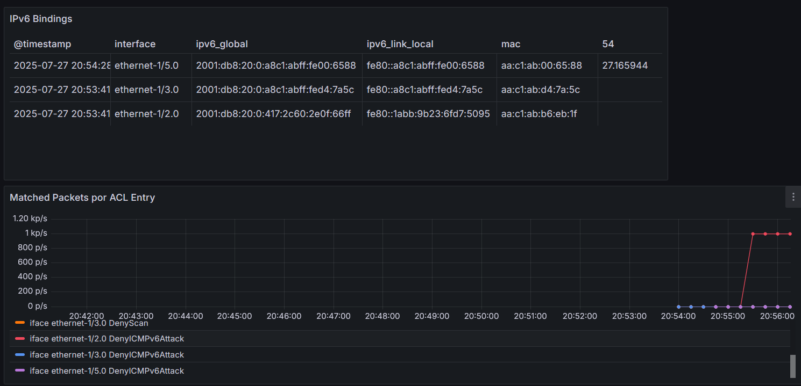
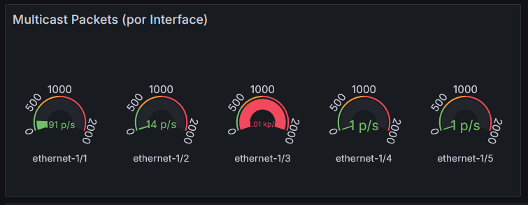

# Telemetría aplicada a la automatización de seguridad en redes IPv6 con Containerlab
---

**[Run](https://codespaces.new/ernestosv73/telemetria-ipv6?quickstart=1) this lab in GitHub Codespaces for free**.  
[Learn more](https://containerlab.dev/manual/codespaces) about Containerlab for Codespaces.  
<small>Machine type: 2 vCPU · 8 GB RAM</small>

---
La topología creada provee un laboratorio de pruebas para la automatización de seguridad en Redes IPv6 basado en los protocolos gNMI, JSON-RPC, integrado con Scapy y Python.

## Funcionalidad nodo gNMIc

| Script |Funcionalidad  |
|--|--|
| gnmic-config.yml |Descubrimiento automático de nodos que se conectan a la red, (port, mac-addrs) / output file: mac_updates.json  
| icmpv6_capturav2.py |Captura tráfico ICMPv6 RS NS en proceso SLAAC.
|                 | Correlaciona tráfico capturado con archivo mac_updates.json 
|                 | Output file: mac_ipv6_bindings_dynamic.json
| sync_bindings.py | Genera ACLs por interface y envía a Nokia Switch vía JSON-RPC
|                | Input file: mac_ipv6_bindings_dynamic.json  
| gnmic-config-acl.yml| Suscripción de métricas ACL match packets y envío a Stack Telemetría Prometheus/Grafana

* Todos los scripts fueron integrados y controlados por el Sistema de Control de Procesos Supervisord.
* Acceder al nodo gNMIc ejecutando: `docker exec -it clab-telemetria-gNMIc /bin/bash`. Desde el directorio root, ejecutar `supervisord -c supervisord.conf`
  
## Conexión a los nodos PC1, PC2, PC4
* `docker exec -it clab-telemetria-PCx /bin/bash`
* Simular la conexión a la red ejecuntado: `ifconfig eth1 down` `ifconfig eth1 up`

## Stack Telemetría
* Visualización de métricas en Grafana / Dashboard Telemetría IPv6
* Acceder desde navegador en host local a la url: `http://ip-hostlocal:3000`
  
## Ejemplos ataques
### Flooding neighbor advertisements. From https://www.kali.org/tools/thc-ipv6/#atk6-flood_advertise6
>***atk6-flood_advertise6:** Flood the target /64 network with ICMPv6 NA messages random IPv6 link local address.
* Desde **PC1**
  *  Lanzar el ataque ejecutando: `atk6-flood_advertise6 eth1`
  *  Ataque mitigado por ACL IPv6 bindings permitidos. Visualización en Dashboard Matched Packets por ACL Entry.
    

### Flooding Router Soliciation. From https://www.kali.org/tools/thc-ipv6/#atk6-flood_solicitate6
>***atk6-flood_rs6:** Flood the local network with ICMPv6 Router Soliciation packets with real source IPv6 link local address.
* Desde **PC2**
  *  Lanzar el ataque ejecutando: `atk6-flood_rs6 eth1`
  *  Ataque detectado por Métricas Multicast Packets por Interface. Visualización en Dashboard.
      
    
